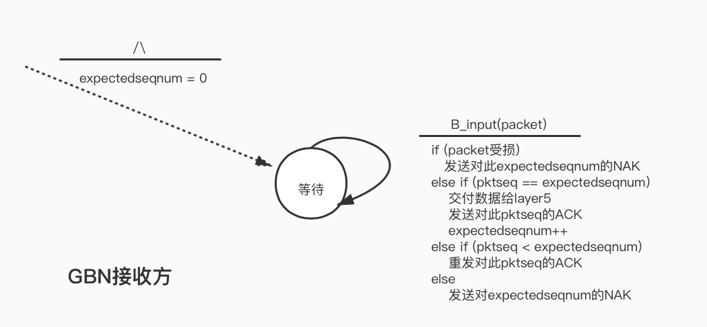
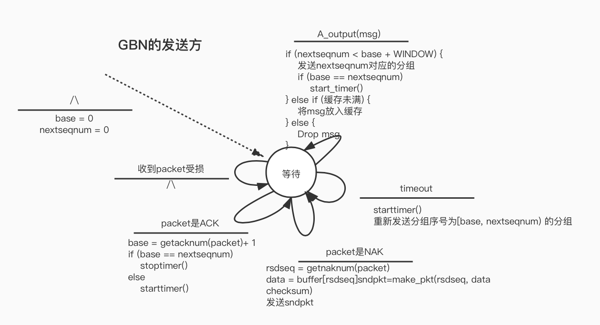

# Computer Networking - 可靠数据传输协议

《计算机网络 自顶向下方法》配套实验

实现一个可靠数据传输协议（reliable data transfer protocol)，实验[链接](https://media.pearsoncmg.com/aw/aw_kurose_network_3/labs/lab5/lab5.html)

## 一、比特交换协议

基于停止等待的理论，使用校验和、序号、肯定否定ACK、重传和定时器的技术，实现一个在不可靠网络上的单项数据传输的可靠协议。

停止等待：发送方在发送了一个数据包（分组）后等待接收方的回应，在此期间不发送任何数据。

序号：为了使接收方知道发送方是否在重传前一个发送分组（接收到的分组序号与最近收到的分组序号相同），在停止等待协议中，使用1比特的序号即可。

否定ACK：对上次正确接收的分组发送一个ACK（冗余ACK），即可实现否定ACK。

定时器：如果当前发送完分组后在一定时间内没有收到对应的ACK，那么进行重传。

### 实验框架

实验网络环境为模拟环境，分为3部分。layer5代表应用层，layer4是我们要实现的可靠数据传输层，layer3是不可靠的传输媒介。实验中实现的是单向的数据传输（A发送，B接收）

参考课本上图3-15 的发送方状态转移图和 3-14的接收方状态转移图。

应用层会调用A_outout(msg)向B发送数据，A需要构建发送分组，开启定时器。

A_input（pkt）函数用于从layer3中接收B发来的ACK信息，进行处理，判断ACK的类型和数据包是否受损。

A_timerinterrupt() 函数用于处理当前发送的分组超时后的重传。

B_input（pkt）函数从layer3中接收A发送的数据，进行处理（发送给数据接收的应用层layer5）并进行回复。

接收方和发送方的状态记录结构以及相应初始化：
```c
const int WCALL = 0, WACK = 1;
typedef struct astate{
    int state;  // 当前处于等待调用 或 等待ack的状态
    int curseq;
    int checksum;
    char data[20];
}AState;

const int WZERO = 0, WONE = 1;
typedef struct bstate{
    int state;
}BState;

AState A_State;
BState B_State;

void A_init()
{
    A_State.checksum = 0;
    A_State.state = WCALL;
    A_State.curseq = 0;
}
void B_init()
{
    B_State.state = WZERO;
}
```
A_output
```c
float timer_increment = 50;

int compute_pkt_sum(struct pkt packet) {
    int sum = 0;
    for (int i = 0; i < 20; i++ ) {
        sum += packet.payload[i];
    }
    sum += packet.acknum;
    sum += packet.seqnum;
    return sum;
}

/* called from layer 5, passed the data to be sent to other side */
void A_output(message)
  struct msg message;
{
    if (A_State.state == WCALL) {
        struct pkt pkt_to_send = {.acknum = A_State.curseq,
                .seqnum = A_State.curseq};
        for (int i = 0; i < 20; i++) {
            char d = message.data[i];
            pkt_to_send.payload[i] = d;
            A_State.data[i] = d;
        }
        pkt_to_send.checksum = compute_pkt_sum(pkt_to_send);

        A_State.state = WACK;

        starttimer(A, timer_increment);

        tolayer3(A, pkt_to_send);

        if (TRACE > 2) {
            printf("A: Being called.\n");
        }
    } else {
        ADropped_msg++;
        if (TRACE > 2) {
            printf("A: Drop Message.\n");
        }
    }
}
```
A_input
```c
/* called from layer 3, when a packet arrives for layer 4 */
void A_input(packet)
  struct pkt packet;
{
    if (A_State.state == WACK) {
        if (packet.acknum == A_State.curseq && packet.checksum == compute_pkt_sum(packet)) {
            if (TRACE > 2) {
                printf("A: valid ACK.\n");
            }
            stoptimer(A);

            A_State.curseq = !A_State.curseq;
            A_State.checksum = 0;
            A_State.state = WCALL;

            ACKed_msg++;

        } else {
            printf("A: Invalid checksum or pktACK %d != curseq %d\n", packet.acknum, A_State.curseq);
        }
    } else {
        if (TRACE > 2) {
            printf("A: Invalid ACK.\n");
        }
    }
}
```
B_input
```c
void B_input(packet)
  struct pkt packet;
{
    struct pkt response;
    for (int i = 0; i < 20; ++i) {
        response.payload[i] = 0;
    }

    if (packet.seqnum == B_State.state && packet.checksum == compute_pkt_sum(packet)) {
        if (TRACE > 2) {
            printf("B: Receive valid data. ACK%d\n", B_State.state);
        }
        tolayer5(B, packet.payload);

        response.acknum = B_State.state;
        response.seqnum = B_State.state;
        response.checksum = compute_pkt_sum(response);

        tolayer3(B, response);

        B_State.state = !B_State.state;
    } else {
        if (TRACE > 2) {
            printf("B: Resend ACK%d.\n", !B_State.state);
        }

        BACK_resend++;

        // 冗余ack
        response.acknum = !B_State.state;
        response.seqnum = !B_State.state;
        response.checksum = compute_pkt_sum(response);
        tolayer3(B, response);
    }
}
```
A_timerinterrupt
```c
void A_timerinterrupt()
{
    if (TRACE > 2) {
        printf("A: time out, resend packet.\n");
    }

    AResend_msg++;

    // resend packet
    struct pkt packet = {.acknum = A_State.curseq, .checksum = A_State.checksum, .seqnum = A_State.curseq};
    for (int i = 0; i < 20; i++) {
        packet.payload[i] = A_State.data[i];
    }
    tolayer3(A, packet);
    starttimer(A, timer_increment);
}
```
### 测试

使用的超时间隔是50，应用发来数据包的间隔是100。原程序中我还增加了一些记录用的变量，统计丢包率之类的。没有丢包受损的情况下，一次收发在TRACE=3的debug输出为：
```sh
EVENT time: 69.657104,  type: 1, fromlayer5  entity: 0
          GENERATE NEXT ARRIVAL: creating new arrival
            INSERTEVENT: time is 69.657104
            INSERTEVENT: future time will be 196.618607
          MAINLOOP: data given to student: aaaaaaaaaaaaaaaaaaaa
          START TIMER: starting timer at 69.657104
            INSERTEVENT: time is 69.657104
            INSERTEVENT: future time will be 119.657104
          TOLAYER3: seq: 0, ack 0, check: 1940 aaaaaaaaaaaaaaaaaaaa
          TOLAYER3: scheduling arrival on other side
            INSERTEVENT: time is 69.657104
            INSERTEVENT: future time will be 75.066002
A: Being called.

EVENT time: 75.066002,  type: 2, fromlayer3  entity: 1
B: Receive valid data. ACK0
          TOLAYER5: data received: aaaaaaaaaaaaaaaaaaaa
          TOLAYER3: seq: 0, ack 0, check: 0 
          TOLAYER3: scheduling arrival on other side
            INSERTEVENT: time is 75.066002
            INSERTEVENT: future time will be 79.824150

EVENT time: 79.824150,  type: 2, fromlayer3  entity: 0
A: valid ACK.
          STOP TIMER: stopping timer at 79.824150
```
丢包重传的情况：
```sh
EVENT time: 286.424072,  type: 1, fromlayer5  entity: 0
          GENERATE NEXT ARRIVAL: creating new arrival
            INSERTEVENT: time is 286.424072
            INSERTEVENT: future time will be 289.861755
          MAINLOOP: data given to student: cccccccccccccccccccc
          START TIMER: starting timer at 286.424072
            INSERTEVENT: time is 286.424072
            INSERTEVENT: future time will be 336.424072
          TOLAYER3: seq: 0, ack 0, check: 1980 cccccccccccccccccccc
          TOLAYER3: scheduling arrival on other side
            INSERTEVENT: time is 286.424072
            INSERTEVENT: future time will be 293.377441
A: Being called.

EVENT time: 289.861755,  type: 1, fromlayer5  entity: 0
          GENERATE NEXT ARRIVAL: creating new arrival
            INSERTEVENT: time is 289.861755
            INSERTEVENT: future time will be 483.757172
          MAINLOOP: data given to student: dddddddddddddddddddd
A: Drop Message.

EVENT time: 293.377441,  type: 2, fromlayer3  entity: 1
B: Receive valid data. ACK0
          TOLAYER5: data received: cccccccccccccccccccc
          TOLAYER3: packet being lost

EVENT time: 336.424072,  type: 0, timerinterrupt   entity: 0
A: time out, resend packet.
          TOLAYER3: seq: 0, ack 0, check: 0 cccccccccccccccccccc
          TOLAYER3: scheduling arrival on other side
            INSERTEVENT: time is 336.424072
            INSERTEVENT: future time will be 343.941284
          START TIMER: starting timer at 336.424072
            INSERTEVENT: time is 336.424072
            INSERTEVENT: future time will be 386.424072

EVENT time: 343.941284,  type: 2, fromlayer3  entity: 1
B: Resend ACK0.
          TOLAYER3: seq: 0, ack 0, check: 0 
          TOLAYER3: scheduling arrival on other side
            INSERTEVENT: time is 343.941284
            INSERTEVENT: future time will be 350.816040

EVENT time: 350.816040,  type: 2, fromlayer3  entity: 0
A: valid ACK.
          STOP TIMER: stopping timer at 350.816040
```
## 二、Go-back-N

画了接收方和发送方的有限状态机。





### 实现

相比比特交换协议，接收方的增加了对收到msg的缓存，这边我使用了一个循环数组来实现缓存，base、nextseqnum、tail指针将缓存分为了四个部分：已发送且收到确认的msg ``[0, base)``，已发送但未收到确认的msg ``[base, nextseqnum)``，窗口中等待发送的msg ``[nextseqnum, min(tail, base+WINDOW) )``, 缓存的msg ``[base，tail]``。
```c
#define MAXBUFFER 50
#define WINDOW 8


typedef struct astate{
    int base;
    int nextseqnum;
    char buffer[MAXBUFFER][20];
    int tail;
    int buf_size;
}AState;

int insert_tail(AState* astate, char* data) {
    if (astate->buf_size == MAXBUFFER) {
        return 0;
    }
    for (int i = 0; i < 20; ++i) {
        astate->buffer[astate->tail][i] = data[i];
    }
    astate->tail = (astate->tail + 1) % MAXBUFFER;
    astate->buf_size++;
    return 1;
}

typedef struct bstate{
    int expectedseqnum;
}BState;
```
具体实现时注意缓存是循环使用的，使用buf_size记录已经缓存的数据量，完整代码[链接](https://gitee.com/sugarcoder/ComputerNetworkingLab.git)

### 测试

设置的超时为100，消息间隔为50，丢包率为0.1，受损率为0.1，总共发送10个消息，TRACE=2。

正常收发

```txt
EVENT time: 34.828552,  type: 1, fromlayer5  entity: 0
A: Got Message ,window [0, 0)

EVENT time: 40.237450,  type: 2, fromlayer3  entity: 1
B: ACK 0

EVENT time: 44.995598,  type: 2, fromlayer3  entity: 0
A: Receive valid ACK, window updated:[1, 1)
EVENT time: 98.309303,  type: 1, fromlayer5  entity: 0
A: Got Message ,window [1, 1)

EVENT time: 107.837433,  type: 2, fromlayer3  entity: 1
B: ACK 1

EVENT time: 117.540672,  type: 2, fromlayer3  entity: 0
A: Receive valid ACK, window updated:[2, 2)
```
丢包
```txt
A: Got Message ,window [2, 2)

EVENT time: 153.000458,  type: 2, fromlayer3  entity: 1
B: ACK 2
          TOLAYER3: packet being lost

EVENT time: 238.246262,  type: 1, fromlayer5  entity: 0
A: Got Message ,window [2, 3)

EVENT time: 243.212036,  type: 0, timerinterrupt   entity: 0
A: time out. Go back N.[2, 4)
A: Resend seq 2
          TOLAYER3: packet being lost
A: Resend seq 3

EVENT time: 244.415878,  type: 2, fromlayer3  entity: 1
B: ACK 3

EVENT time: 251.290649,  type: 2, fromlayer3  entity: 0
A: Receive valid ACK, window updated:[4, 4)
```
重传
```txt
A: time out. Go back N.[4, 6)
A: Resend seq 4
A: Resend seq 5

EVENT time: 426.913330,  type: 2, fromlayer3  entity: 1
B: ACK 5
          TOLAYER3: packet being corrupted

EVENT time: 430.196320,  type: 2, fromlayer3  entity: 1
B: resend ACK 4

EVENT time: 432.601593,  type: 2, fromlayer3  entity: 1
B: resend ACK 5
          TOLAYER3: packet being lost

EVENT time: 433.927460,  type: 2, fromlayer3  entity: 0
A: Invalid packet data.

EVENT time: 441.234406,  type: 2, fromlayer3  entity: 0
Warning: attempt to start a timer that is already started
A: Receive valid ACK, window updated:[5, 6)
```
