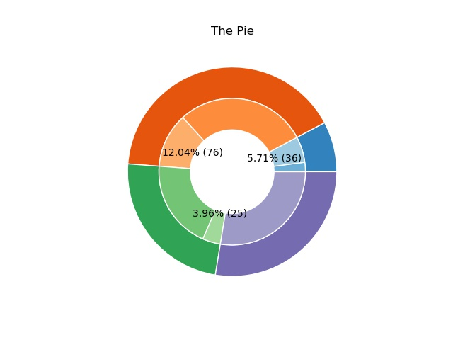

# 画饼
最近要把实验结果搞得好看一点，准备画个饼图。

找matplotlib的gallery找到了一个同心饼图，准备在内圈中每隔一个色块加一个label，看[matplotlib.axes.Axes.pie](https://matplotlib.org/stable/api/_as_gen/matplotlib.axes.Axes.pie.html#matplotlib.axes.Axes.pie)的官方文档发现有个autopct的参数，一般用来设置饼图中每个扇形的圈上文字标签，但这个autopct也可以接受一个函数作为输入。

在[stackoverflow](https://stackoverflow.com/questions/6170246/how-do-i-use-matplotlib-autopct/6170354#6170354)上找到了用法。需要自己定义一个返回函数的函数，来个性化这个autopct的输出。

使用python闭包的特性，在外层函数中定义记录布尔变量shouldPrint，记录上个扇形是否被标记。
```python
def make_autopct(values):
    shouldPrint = False

    def my_autopct(pct):
        nonlocal shouldPrint
        total = sum(values)
        val = int(round(pct*total/100.0))
        if shouldPrint:
            shouldPrint = False
            if val != 0:
                return '{p:.2f}% ({v:d})'.format(p=pct, v=val)
            else:
                return ''
        else:
            shouldPrint = True
            return ''
    return my_autopct
```
再将这个函数作为参数传给autopct，参数是平整后的vals一位数组
```python
def plotPie():
    vals = np.array([[30, 60], [20, 40], [55, 43], [22, 0]])
    fig, ax = plt.subplots()

    size = 0.3

    cmap = plt.get_cmap("tab20c")
    outer_colors = cmap(np.arange(4) * 4)
    inner_colors = cmap([1, 2, 5, 6, 9, 10, 13, 14])

    ax.pie(vals.sum(axis=1), radius=1, colors=outer_colors, labels=outer_labels,
           wedgeprops=dict(width=size, edgecolor='w'))

    ax.pie(vals.flatten(), radius=1 - size, colors=inner_colors, autopct=make_autopct(vals.flatten()),
           wedgeprops=dict(width=size, edgecolor='w'))

    ax.set(aspect="equal", title='The Pie')
    plt.show()
```
🫓如下


