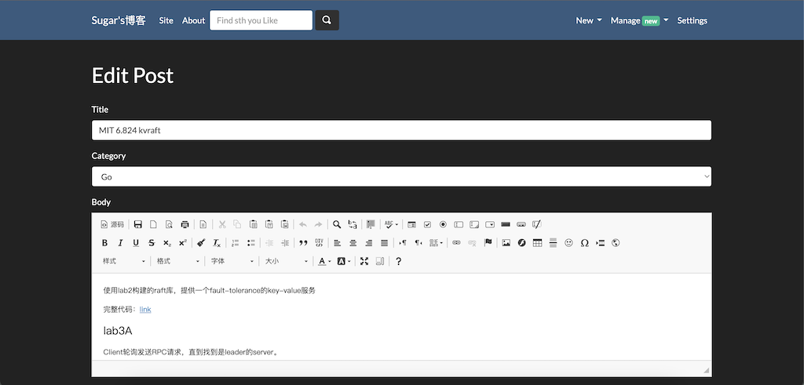

# 构建mdbook的博客
2022/10/28
我的新博客从这里开始

## Motivation
原来的博客bluelog放在云服务器上，快到期了，不想续费了。


bluelog用flask构建，维护成本比较高，在线编辑博客的功能虽然不错，但是还是有很多缺点，比如容易丢失已经在线编辑的内容，代码高亮需要手动使用highlight.js的``<pre><code>``标签。


一直想找一款非常方便的基于markdown的博客，于是就在看文档的时候选择了rust编写的mdbook。于是我就把原来的bluelog打包进docker image留着过年，开始部署我的mdbook的博客。

## 安装mdbook
参考[mdbook](https://rust-lang.github.io/mdBook/index.html)官方文档
```shell
$cargo install mdbook
$mdbook init my_mdbook_blog
$mdbook serve --open
$cd my_mdbook_blog
$git init
$git checkout -b mdbook
$git remote add githubpage git@github.com:Sugar-Coder/Sugar-Coder.github.io.git
$git push githubpage mdbook 
```
仍然用原站点仓库作为远端仓库

## 使用github-action来发布
设置我的仓库的default branch为mdbook

[参考](https://github.com/rust-lang/mdBook/wiki/Automated-Deployment%3A-GitHub-Actions)编写.github/workblow/deploy.yml
```yml
name: Deploy
on:
  push:
    branches:
      - mdbook

jobs:
  deploy:
    runs-on: ubuntu-latest
    steps:
    - uses: actions/checkout@v2
      with:
        fetch-depth: 0
    - name: Install mdbook
      run: |
        mkdir mdbook
        curl -sSL https://github.com/rust-lang/mdBook/releases/download/v0.4.14/mdbook-v0.4.14-x86_64-unknown-linux-gnu.tar.gz | tar -xz --directory=./mdbook
        echo `pwd`/mdbook >> $GITHUB_PATH
    - name: Deploy GitHub Pages
      run: |
        # This assumes your book is in the root of your repository.
        # Just add a `cd` here if you need to change to another directory.
        mdbook build
        git worktree add gh-pages
        git config user.name "Deploy from CI"
        git config user.email ""
        cd gh-pages
        # Delete the ref to avoid keeping history.
        git update-ref -d refs/heads/gh-pages
        rm -rf *
        mv ../book/* .
        git add .
        git commit -m "Deploy $GITHUB_SHA to gh-pages"
        git push --force --set-upstream origin gh-pages
```
在github的仓库页面选择settings，将pages的build and deployment的Source选回从分支发布（gh-pages分支）。注意刚才创建yml文件的时候要选择Source为GitHub Actions来创建。再进行push，就可以看到github action负责build和deploy到gh-pages分支，然后再由github-pages发布。

## 试试rust playground
可以运行下面的代码
```rust
println!("Hello, World!");
```