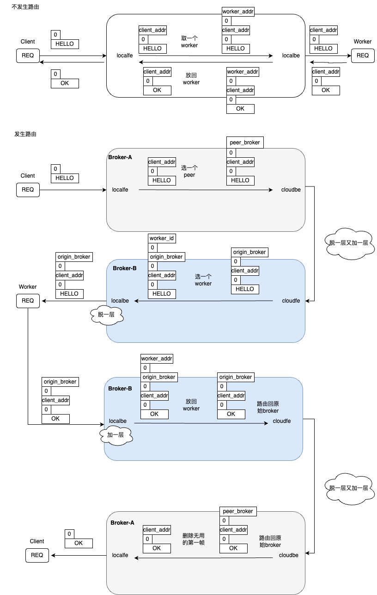
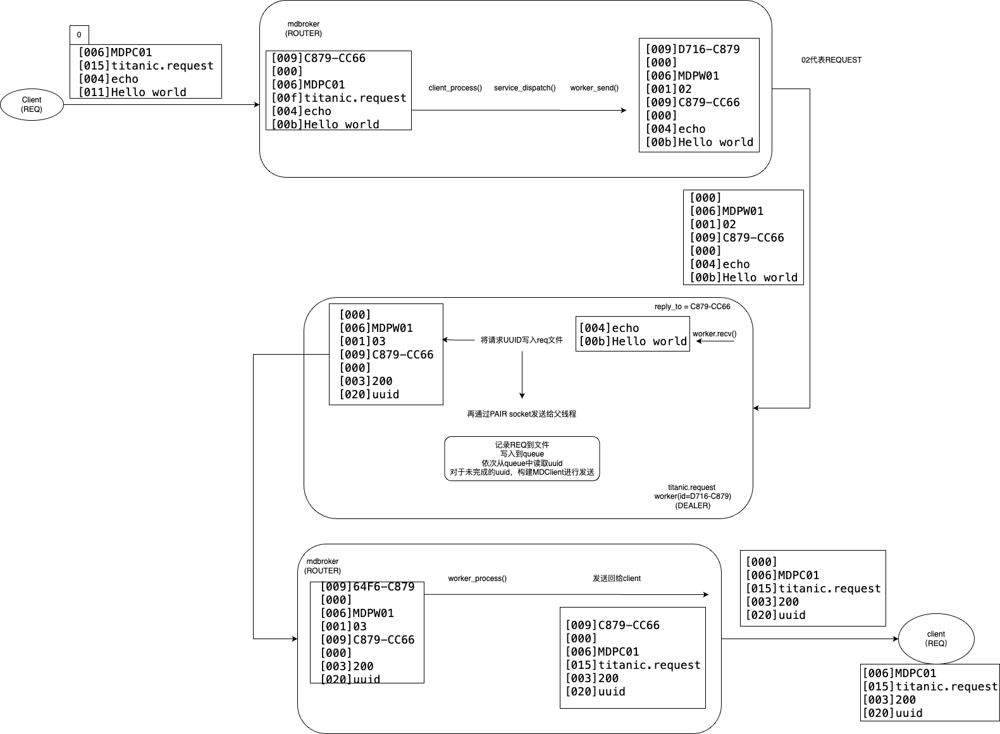

# ZeroMQ

> ZeroMQ (also known as ØMQ, 0MQ, or zmq) looks like an embeddable networking library but acts like a concurrency framework. It gives you sockets that carry atomic messages across various transports like in-process, inter-process, TCP, and multicast. You can connect sockets N-to-N with patterns like fan-out, pub-sub, task distribution, and request-reply. It’s fast enough to be the fabric for clustered products. Its asynchronous I/O model gives you scalable multicore applications, built as asynchronous message-processing tasks. It has a score of language APIs and runs on most operating systems. ZeroMQ is from [iMatix](http://www.imatix.com/) and is LGPLv3 open source.

ZeroMQ提供了多种socket类型，有不同的通讯处理方式（a reusable messaging layer）。用户可以根据对于系统的应用场景，组合合适的socket类型构建系统通讯架构。（[为什么需要OMQ](https://zguide.zeromq.org/docs/chapter1/#Why-We-Needed-ZeroMQ)）

## 理解Request-Reply Combinations

- REQ to REP: 实现同步的请求（client REQ）和同步的回复（server REP）。
- DEALER to REP: 将client的REQ替换成DEALER，实现client异步请求，DEALER实现负载均衡，选择多个server中的一个进行回复（Round-Robin）。
- REQ to ROUTER: 实现了单个异步的server，参考[mtserver](https://zguide.zeromq.org/docs/chapter2/#Multithreading-with-ZeroMQ)实现
- DEALER to ROUTER: 实现异步的client与异步的server通讯。
- DEALER to DEALER: fully asynchronous，需要自己处理[reply envelope](https://zguide.zeromq.org/docs/chapter3/#The-Request-Reply-Mechanisms)
- ROUTER to ROUTER: 实现N-to-N connection。

## 实践 ROUTER to ROUTER connection
### Inter-Broker Routing
在[peering](https://zguide.zeromq.org/docs/chapter3/#Worked-Example-Inter-Broker-Routing)的架构实现中，在broker之间路由任务时，cloudbe（ROUTER）避免不了与其他broker的cloudfe（ROUTER）主动发起通讯，各种socket处理Reply Envelope的方式有所不同：
- REQ socket会在发送的消息前面加空frame。接收消息时，会丢弃第一个空帧后再传递给调用者。
- ROUTER会给来自REQ socket的message增加标识构成envelope，标识REQ的身份，方便ROUTER回传Reply
    > ROUTER uses the reply envelope to decide which client REQ socket to route a reply back to.
- REP socket，会保存和摘除所有identity frames直到并包括分隔符，只传递后续的帧给调用者
- DEALER socket 无视envelope，只讲当前收到的message当作multi-frame message来处理。

下图是消息在broker间传递时，client的消息**发生路由**和**不发生路由**两种方式下，帧格式的变化：

### Titanic Pattern
在ZeroMQ的Guide文档中实现可靠Request-Reply的[Titanic Pattern](https://zguide.zeromq.org/docs/chapter4/#Disconnected-Reliability-Titanic-Pattern)，由于没有C++版本的代码，所以自己实现了一份并提交了[pr](https://github.com/booksbyus/zguide/pull/929)，提升对于ROUTER socket的使用机制理解。

下图是client发送的请求，经过mdbroker后，先在titanic节点持久化，再发送给mdbroker，mdbroker回复给client确认的消息传递过程，以及该过程中详细的帧格式。

